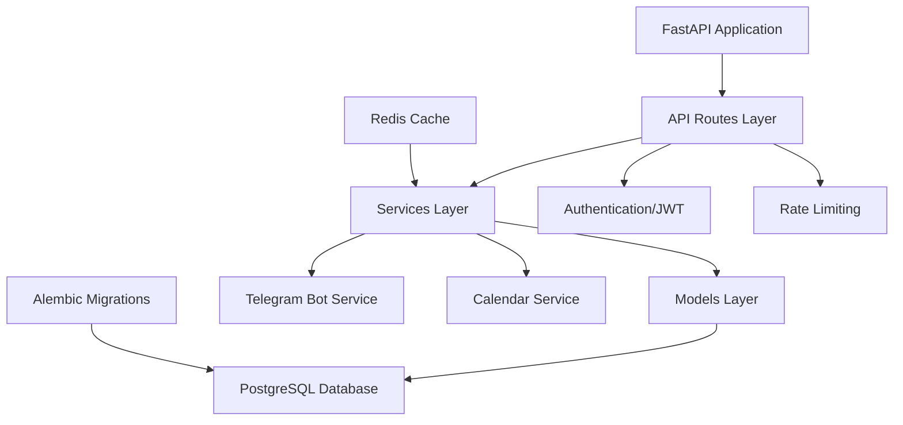
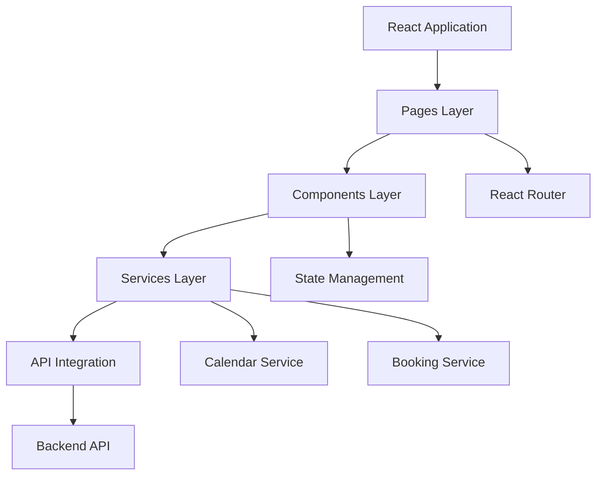

# Code Audit and Cleanup - phStudio Project

## Overview

This design document outlines a comprehensive code audit and cleanup strategy for the phStudio project - a photo studio booking system built with React/TypeScript frontend and FastAPI/Python backend. The project requires thorough analysis, dead code removal, bug fixes, performance optimization, and achieving 80%+ test coverage with 100% coverage for critical components.

## Repository Type Classification

**Project Type**: Full-Stack Application
- **Frontend**: React 19.0.0 + TypeScript + Vite
- **Backend**: FastAPI + Python 3.10 + PostgreSQL
- **Infrastructure**: Docker, GitHub Actions CI/CD
- **External Integrations**: Telegram Bot API, Google Calendar

## Current State Analysis

### Test Coverage Status
```
Current Coverage: 49%
- Models: 100% ✅
- Schemas: 100% ✅ 
- API Routes: 33-55% ⚠️
- Services: 20-42% ❌
- Core Components: 47-89% ⚠️
```

### Identified Issues
1. **Dead Code**: Unused components and utility functions
2. **Duplicate Logic**: Similar availability checking patterns
3. **TODO Items**: Incomplete implementations in auth logging
4. **Code Quality**: Missing type hints, inconsistent error handling
5. **Performance**: Unoptimized database queries and redundant API calls

## Architecture Overview

### Backend Architecture


### Frontend Architecture


## Audit & Cleanup Strategy

### Phase 1: Code Quality Assessment

#### 1.1 Dead Code Identification
**Target Areas:**
- `frontend/src/components/TermsCheckboxes.tsx` - Already identified as unused
- `frontend/src/utils/memoization.ts` - Potentially over-engineered
- Empty `__init__.py` files with minimal content
- Unused imports and dependencies

**Detection Methods:**
- AST analysis for unused exports
- Dependency graph analysis
- Import tracking across modules
- ESLint unused variable detection

#### 1.2 Duplicate Code Analysis
**Identified Patterns:**
- Availability checking logic scattered across:
  - `services/booking/availability.ts`
  - `services/calendar/availability.ts` 
  - `data/availability.ts`
- Date formatting utilities duplicated
- Similar validation patterns in multiple components

### Phase 2: Backend Refactoring

#### 2.1 Service Layer Optimization
**Current Issues:**
- Low test coverage (20-42%)
- Missing type hints
- Incomplete error handling

**Improvements:**
```python
# Before
def get_bookings(user_id):
    return db.query(Booking).filter_by(user_id=user_id).all()

# After  
async def get_bookings(
    user_id: UUID,
    *,
    db: AsyncSession = Depends(get_db)
) -> List[BookingResponse]:
    try:
        result = await db.execute(
            select(Booking)
            .where(Booking.user_id == user_id)
            .options(selectinload(Booking.client))
        )
        return result.scalars().all()
    except SQLAlchemyError as e:
        logger.error(f"Database error in get_bookings: {e}")
        raise HTTPException(500, "Database operation failed")
```

#### 2.2 Database Query Optimization
**Optimization Targets:**
- Add proper indexing for frequently queried fields
- Implement query result caching
- Use bulk operations for mass updates
- Add connection pooling optimization

```sql
-- Index optimization
CREATE INDEX CONCURRENTLY idx_booking_date_status 
ON bookings (booking_date, status) 
WHERE status IN ('pending', 'confirmed');

CREATE INDEX CONCURRENTLY idx_calendar_event_datetime 
ON calendar_events (start_datetime, end_datetime);
```

#### 2.3 API Route Improvements
**Current Coverage: 33-55%**
- Add comprehensive input validation
- Implement consistent error responses
- Add request/response logging
- Improve authentication middleware

### Phase 3: Frontend Optimization

#### 3.1 Component Consolidation
**Refactoring Plan:**
```typescript
// Consolidate availability services
export class AvailabilityService {
  private static instance: AvailabilityService;
  
  static getInstance(): AvailabilityService {
    if (!this.instance) {
      this.instance = new AvailabilityService();
    }
    return this.instance;
  }

  async getSlots(date: string): Promise<BookingSlot[]> {
    // Unified availability logic
  }

  async checkAvailability(date: string, slots: string[]): Promise<boolean> {
    // Consolidated checking logic  
  }
}
```

#### 3.2 State Management Optimization
**Current Issues:**
- Scattered state management
- Redundant API calls
- No global error handling

**Improvements:**
- Implement React Query for server state
- Add global error boundary
- Optimize re-renders with React.memo

### Phase 4: Testing Strategy

#### 4.1 Backend Testing Enhancement
**Target: 80%+ Coverage**

**Unit Tests:**
```python
# Service layer tests
@pytest.mark.asyncio
async def test_booking_service_create():
    # Test business logic in isolation
    pass

@pytest.mark.asyncio  
async def test_booking_service_validation():
    # Test edge cases and validation
    pass
```

**Integration Tests:**
```python
# Full API workflow tests
@pytest.mark.integration
async def test_booking_workflow():
    # Test complete booking flow
    pass
```

#### 4.2 Frontend Testing Strategy
**Current State:** Basic Jest setup
**Target:** 80%+ coverage with comprehensive testing

**Component Tests:**
```typescript
// React Testing Library + Jest
describe('BookingForm', () => {
  test('validates required fields', async () => {
    render(<BookingForm />);
    fireEvent.click(screen.getByText('Submit'));
    expect(screen.getByText('Выберите дату')).toBeInTheDocument();
  });
});
```

**Integration Tests:**
```typescript  
// Playwright E2E tests
test('complete booking flow', async ({ page }) => {
  await page.goto('/booking');
  await page.selectOption('[data-testid=date-picker]', '2024-12-01');
  await page.fill('[data-testid=name-input]', 'Test User');
  await page.click('[data-testid=submit-button]');
  await expect(page.locator('.success-message')).toBeVisible();
});
```

### Phase 5: Performance Optimization

#### 5.1 Backend Performance
**Database Optimization:**
- Query optimization with EXPLAIN ANALYZE
- Connection pooling tuning
- Redis caching for frequently accessed data

**API Performance:**
- Response compression
- Rate limiting optimization  
- Async/await pattern consistency

#### 5.2 Frontend Performance
**Bundle Optimization:**
- Code splitting by routes
- Tree shaking unused dependencies
- Image optimization and lazy loading

**Runtime Performance:**
- Implement React.memo strategically
- Optimize state updates
- Add performance monitoring

## Implementation Roadmap

### Week 1: Assessment & Planning
- [ ] Complete dead code analysis
- [ ] Set up enhanced linting rules
- [ ] Create performance baseline metrics
- [ ] Establish testing infrastructure

### Week 2: Backend Cleanup
- [ ] Remove dead code and unused imports
- [ ] Refactor service layer with proper typing
- [ ] Optimize database queries
- [ ] Implement comprehensive error handling

### Week 3: Frontend Optimization  
- [ ] Consolidate duplicate services
- [ ] Implement unified state management
- [ ] Add performance monitoring
- [ ] Optimize component rendering

### Week 4: Testing Implementation
- [ ] Achieve 80%+ backend test coverage
- [ ] Implement frontend unit tests
- [ ] Add E2E test suite
- [ ] Set up CI/CD test automation

### Week 5: Performance & Documentation
- [ ] Performance optimization implementation
- [ ] Code documentation updates
- [ ] Security audit completion
- [ ] Final integration testing

## Quality Metrics & Success Criteria

### Code Quality Targets
```yaml
Backend:
  - Test Coverage: >80% (Critical: 100%)
  - Type Coverage: >95%
  - Complexity Score: <10 per function
  - Security Score: A+ (Bandit analysis)

Frontend:
  - Test Coverage: >80%
  - Bundle Size: <500KB gzipped
  - Lighthouse Score: >90
  - TypeScript Strict Mode: Enabled
```

### Performance Benchmarks
```yaml
API Response Times:
  - GET /bookings: <200ms
  - POST /bookings: <500ms
  - Authentication: <100ms

Frontend Metrics:
  - First Contentful Paint: <1.5s
  - Largest Contentful Paint: <2.5s
  - Time to Interactive: <3.0s
```

## Risk Mitigation

### Technical Risks
1. **Breaking Changes**: Comprehensive test suite before refactoring
2. **Performance Regression**: Continuous performance monitoring
3. **Data Loss**: Database migration testing with backups
4. **Integration Failures**: Staged deployment with rollback plan

### Implementation Risks
1. **Timeline Pressure**: Prioritize critical functionality first
2. **Resource Constraints**: Parallel development streams
3. **Scope Creep**: Strict adherence to defined objectives

## Testing Framework

### Backend Testing Architecture
```python
# conftest.py - Enhanced test configuration
@pytest.fixture(scope="session")
async def test_db():
    # Isolated test database
    pass

@pytest.fixture
async def client():
    # Test client with authentication
    pass

@pytest.fixture  
async def mock_telegram():
    # Mock external services
    pass
```

### Frontend Testing Architecture
```typescript
// jest.config.js - Comprehensive test setup
module.exports = {
  testEnvironment: 'jsdom',
  setupFilesAfterEnv: ['<rootDir>/src/setupTests.ts'],
  collectCoverageFrom: [
    'src/**/*.{ts,tsx}',
    '!src/**/*.d.ts',
    '!src/index.tsx'
  ],
  coverageThreshold: {
    global: {
      branches: 80,
      functions: 80,
      lines: 80,
      statements: 80
    }
  }
};
```

## Monitoring & Observability

### Application Monitoring
- Performance metrics collection
- Error tracking and alerting
- User experience monitoring
- Database query performance tracking

### Code Quality Monitoring  
- Automated code review with SonarQube
- Security vulnerability scanning
- Dependency update monitoring
- Test coverage reporting

This comprehensive audit and cleanup will transform the phStudio project into a production-ready, maintainable, and high-performance application with enterprise-grade code quality standards.