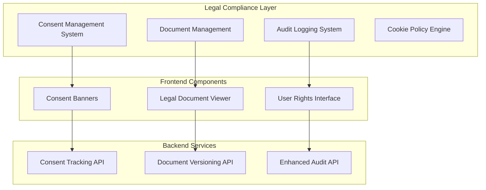

# Legal Compliance Implementation Design for PhotoStudio Platform

## Overview

This document outlines the comprehensive implementation plan to bring the PhotoStudio platform into full compliance with Russian Federation legislation requirements, including data protection laws (152-ФЗ), electronic signature regulations (63-ФЗ), advertising laws (38-ФЗ), consumer protection laws (230-ФЗ), and privacy standards.

## Architecture Overview



## Current Compliance Gap Analysis

| Requirement | Status | Priority | Implementation Needed |
|------------|---------|----------|----------------------|
| Cookie Consent Banner | ❌ Missing | HIGH | Complete implementation |
| Cookie Policy Document | ❌ Missing | HIGH | Legal document creation |
| Enhanced Audit Logging | ⚠️ Partial | HIGH | Legal compliance extensions |
| Document Versioning | ❌ Missing | MEDIUM | Version tracking system |
| Consent Granularity | ⚠️ Basic | MEDIUM | Enhanced tracking |
| Public Offer Structure | ⚠️ Informal | MEDIUM | Legal formalization |
| Operator Registration | ❌ Missing | HIGH | Regulatory compliance |

## Database Schema Extensions

### Consent Management Tables

```sql
-- User Consent Tracking with Legal Requirements
CREATE TABLE user_consents (
    id SERIAL PRIMARY KEY,
    user_identifier VARCHAR(255) NOT NULL, -- IP or session ID for anonymous users
    consent_type VARCHAR(50) NOT NULL, -- 'privacy', 'terms', 'cookies', 'marketing'
    consent_given BOOLEAN NOT NULL,
    consent_timestamp TIMESTAMP WITH TIME ZONE NOT NULL,
    ip_address INET NOT NULL,
    user_agent TEXT,
    consent_version VARCHAR(50) NOT NULL,
    withdrawal_timestamp TIMESTAMP WITH TIME ZONE,
    legal_basis VARCHAR(100) NOT NULL DEFAULT 'consent',
    created_at TIMESTAMP WITH TIME ZONE DEFAULT NOW()
);

-- Legal Document Versioning
CREATE TABLE legal_documents (
    id SERIAL PRIMARY KEY,
    document_type VARCHAR(50) NOT NULL, -- 'privacy_policy', 'terms_of_service', 'cookie_policy'
    version VARCHAR(20) NOT NULL,
    title TEXT NOT NULL,
    content TEXT NOT NULL,
    published_date TIMESTAMP WITH TIME ZONE NOT NULL,
    effective_date TIMESTAMP WITH TIME ZONE NOT NULL,
    is_active BOOLEAN DEFAULT false,
    created_by INTEGER REFERENCES users(id),
    hash_signature VARCHAR(255) -- For document integrity
);

-- Enhanced Audit Logging for Legal Compliance
CREATE TABLE compliance_audit_logs (
    id SERIAL PRIMARY KEY,
    event_type VARCHAR(100) NOT NULL,
    user_identifier VARCHAR(255),
    ip_address INET NOT NULL,
    user_agent TEXT,
    action_details JSONB NOT NULL,
    timestamp TIMESTAMP WITH TIME ZONE DEFAULT NOW(),
    retention_until TIMESTAMP WITH TIME ZONE, -- Legal retention requirements
    document_versions JSONB -- Track which document versions were active
);
```

## Backend Implementation

### Enhanced Consent Management Service

```python
class ConsentManagementService:
    """Manages user consent collection with legal compliance"""
    
    def record_booking_consent(
        self,
        booking_data: Dict,
        ip_address: str,
        user_agent: str,
        consent_versions: Dict[str, str]
    ) -> Dict[str, Any]:
        """Record all required consents for booking with audit trail"""
        
        user_identifier = f"booking_{booking_data['client_phone']}"
        
        # Record privacy consent (required)
        privacy_consent = UserConsent(
            user_identifier=user_identifier,
            consent_type="privacy",
            consent_given=True,
            ip_address=ip_address,
            user_agent=user_agent,
            consent_version=consent_versions["privacy"],
            legal_basis="contract_performance"
        )
        
        # Record terms acceptance (required)
        terms_consent = UserConsent(
            user_identifier=user_identifier,
            consent_type="terms",
            consent_given=True,
            ip_address=ip_address,
            user_agent=user_agent,
            consent_version=consent_versions["terms"],
            legal_basis="contract_performance"
        )
        
        self.db.add_all([privacy_consent, terms_consent])
        
        # Create compliance audit log
        audit_log = ComplianceAuditLog(
            event_type="BOOKING_CONSENT_RECORDED",
            user_identifier=user_identifier,
            ip_address=ip_address,
            user_agent=user_agent,
            action_details={
                "booking_id": booking_data.get("id"),
                "consents_recorded": ["privacy", "terms"],
                "consent_versions": consent_versions,
                "data_collected": ["client_name", "client_phone"],
                "legal_basis": "contract_performance"
            },
            document_versions=consent_versions,
            retention_until=datetime.now(timezone.utc) + timedelta(days=2555)  # 7 years
        )
        
        self.db.add(audit_log)
        self.db.commit()
        
        return {
            "consent_recorded": True,
            "consents": ["privacy", "terms"],
            "audit_log_id": audit_log.id
        }
```

### Cookie Consent Management

```python
class CookieConsentService:
    """Manages cookie consent according to Russian legislation"""
    
    COOKIE_CATEGORIES = {
        "essential": {
            "name": "Необходимые",
            "description": "Обеспечивают базовую функциональность сайта",
            "required": True
        },
        "functional": {
            "name": "Функциональные", 
            "description": "Запоминают настройки и предпочтения",
            "required": False
        },
        "analytics": {
            "name": "Аналитические",
            "description": "Помогают анализировать использование сайта",
            "required": False
        },
        "marketing": {
            "name": "Маркетинговые",
            "description": "Используются для показа релевантной рекламы",
            "required": False
        }
    }
    
    def record_cookie_consent(
        self,
        ip_address: str,
        user_agent: str,
        accepted_categories: List[str]
    ) -> Dict[str, Any]:
        """Record cookie consent with category breakdown"""
        
        user_identifier = f"cookie_{ip_address}"
        
        for category in accepted_categories:
            consent = UserConsent(
                user_identifier=user_identifier,
                consent_type=f"cookie_{category}",
                consent_given=True,
                ip_address=ip_address,
                user_agent=user_agent,
                consent_version="1.0",
                legal_basis="consent"
            )
            self.db.add(consent)
        
        # Log for compliance
        audit_log = ComplianceAuditLog(
            event_type="COOKIE_CONSENT_RECORDED",
            user_identifier=user_identifier,
            ip_address=ip_address,
            action_details={
                "accepted_categories": accepted_categories,
                "all_categories": list(self.COOKIE_CATEGORIES.keys()),
                "consent_method": "banner_interaction"
            }
        )
        
        self.db.add(audit_log)
        self.db.commit()
        
        return {
            "categories_accepted": accepted_categories,
            "consent_recorded": True
        }
```

## Frontend Implementation

### Cookie Consent Banner

```typescript
interface CookieConsent {
  essential: boolean;
  functional: boolean;
  analytics: boolean;
  marketing: boolean;
}

const CookieConsentBanner: React.FC = () => {
  const [isVisible, setIsVisible] = useState(false);
  const [showDetails, setShowDetails] = useState(false);
  const [consents, setConsents] = useState<CookieConsent>({
    essential: true, // Always required
    functional: false,
    analytics: false,
    marketing: false
  });

  useEffect(() => {
    const hasConsent = localStorage.getItem('cookie_consent_recorded');
    if (!hasConsent) {
      setIsVisible(true);
    }
  }, []);

  const handleAcceptAll = () => {
    const allConsents = {
      essential: true,
      functional: true,
      analytics: true,
      marketing: true
    };
    recordConsent(allConsents);
  };

  const handleRejectNonEssential = () => {
    const essentialOnly = {
      essential: true,
      functional: false,
      analytics: false,
      marketing: false
    };
    recordConsent(essentialOnly);
  };

  const handleCustomSave = () => {
    recordConsent(consents);
  };

  const recordConsent = async (consentData: CookieConsent) => {
    try {
      const acceptedCategories = Object.entries(consentData)
        .filter(([_, accepted]) => accepted)
        .map(([category, _]) => category);

      await fetch('/api/cookie-consent/record', {
        method: 'POST',
        headers: { 'Content-Type': 'application/json' },
        body: JSON.stringify({ accepted_categories: acceptedCategories })
      });

      localStorage.setItem('cookie_consent_recorded', 'true');
      localStorage.setItem('cookie_preferences', JSON.stringify(consentData));
      setIsVisible(false);
    } catch (error) {
      console.error('Failed to record cookie consent:', error);
    }
  };

  if (!isVisible) return null;

  return (
    <div className="fixed bottom-0 left-0 right-0 bg-gray-900 text-white p-4 z-50 shadow-lg">
      <div className="max-w-6xl mx-auto">
        {!showDetails ? (
          <div className="flex flex-col md:flex-row items-center justify-between gap-4">
            <div className="flex-1">
              <h3 className="font-semibold mb-2">Использование файлов cookie</h3>
              <p className="text-sm text-gray-300">
                Мы используем файлы cookie для обеспечения работы сайта и улучшения опыта использования. 
                Подробнее в{' '}
                <Link to="/cookie-policy" className="underline text-blue-300">
                  Политике использования cookie
                </Link>
              </p>
            </div>
            <div className="flex gap-2">
              <button
                onClick={handleRejectNonEssential}
                className="px-4 py-2 border border-gray-500 rounded text-sm hover:bg-gray-700"
              >
                Только необходимые
              </button>
              <button
                onClick={() => setShowDetails(true)}
                className="px-4 py-2 border border-gray-500 rounded text-sm hover:bg-gray-700"
              >
                Настроить
              </button>
              <button
                onClick={handleAcceptAll}
                className="px-4 py-2 bg-blue-600 rounded text-sm hover:bg-blue-700"
              >
                Принять все
              </button>
            </div>
          </div>
        ) : (
          <div className="space-y-4">
            <h3 className="font-semibold">Настройки файлов cookie</h3>
            
            <div className="grid grid-cols-1 md:grid-cols-2 gap-4">
              <div className="space-y-3">
                <label className="flex items-center space-x-3">
                  <input
                    type="checkbox"
                    checked={consents.essential}
                    disabled
                    className="accent-blue-600"
                  />
                  <div>
                    <div className="font-medium">Необходимые cookie</div>
                    <div className="text-sm text-gray-300">
                      Обеспечивают базовую функциональность сайта
                    </div>
                  </div>
                </label>

                <label className="flex items-center space-x-3">
                  <input
                    type="checkbox"
                    checked={consents.functional}
                    onChange={(e) => setConsents({...consents, functional: e.target.checked})}
                    className="accent-blue-600"
                  />
                  <div>
                    <div className="font-medium">Функциональные cookie</div>
                    <div className="text-sm text-gray-300">
                      Запоминают настройки и предпочтения
                    </div>
                  </div>
                </label>
              </div>

              <div className="space-y-3">
                <label className="flex items-center space-x-3">
                  <input
                    type="checkbox"
                    checked={consents.analytics}
                    onChange={(e) => setConsents({...consents, analytics: e.target.checked})}
                    className="accent-blue-600"
                  />
                  <div>
                    <div className="font-medium">Аналитические cookie</div>
                    <div className="text-sm text-gray-300">
                      Помогают анализировать использование сайта
                    </div>
                  </div>
                </label>

                <label className="flex items-center space-x-3">
                  <input
                    type="checkbox"
                    checked={consents.marketing}
                    onChange={(e) => setConsents({...consents, marketing: e.target.checked})}
                    className="accent-blue-600"
                  />
                  <div>
                    <div className="font-medium">Маркетинговые cookie</div>
                    <div className="text-sm text-gray-300">
                      Используются для персонализированной рекламы
                    </div>
                  </div>
                </label>
              </div>
            </div>

            <div className="flex justify-between pt-4">
              <button
                onClick={() => setShowDetails(false)}
                className="px-4 py-2 border border-gray-500 rounded text-sm hover:bg-gray-700"
              >
                Назад
              </button>
              <button
                onClick={handleCustomSave}
                className="px-4 py-2 bg-blue-600 rounded text-sm hover:bg-blue-700"
              >
                Сохранить настройки
              </button>
            </div>
          </div>
        )}
      </div>
    </div>
  );
};
```

### Enhanced Booking Form with Legal Compliance

```typescript
const EnhancedBookingForm: React.FC = () => {
  const [legalDocuments, setLegalDocuments] = useState<{
    privacy: { version: string; url: string };
    terms: { version: string; url: string };
  }>({
    privacy: { version: '', url: '' },
    terms: { version: '', url: '' }
  });

  useEffect(() => {
    // Fetch current document versions
    const fetchDocumentVersions = async () => {
      try {
        const [privacyDoc, termsDoc] = await Promise.all([
          fetch('/api/documents/privacy_policy/current').then(r => r.json()),
          fetch('/api/documents/terms_of_service/current').then(r => r.json())
        ]);

        setLegalDocuments({
          privacy: { version: privacyDoc.version, url: '/privacy-policy' },
          terms: { version: termsDoc.version, url: '/terms-of-service' }
        });
      } catch (error) {
        console.error('Failed to fetch document versions:', error);
      }
    };

    fetchDocumentVersions();
  }, []);

  const handleSubmitWithConsent = async (bookingData: any) => {
    const consentData = {
      booking_data: bookingData,
      consent_versions: {
        privacy: legalDocuments.privacy.version,
        terms: legalDocuments.terms.version
      },
      ip_address: await getClientIP(), // Implementation needed
      user_agent: navigator.userAgent
    };

    try {
      const response = await fetch('/api/booking/create-with-consent', {
        method: 'POST',
        headers: { 'Content-Type': 'application/json' },
        body: JSON.stringify(consentData)
      });

      if (response.ok) {
        // Booking created successfully with consent recorded
        const result = await response.json();
        alert(`Бронирование создано! ID: ${result.booking_id}`);
      }
    } catch (error) {
      console.error('Booking submission failed:', error);
    }
  };

  return (
    <div className="max-w-2xl mx-auto p-6">
      {/* Existing booking form components */}
      
      {/* Enhanced consent section */}
      <div className="border border-blue-200 bg-blue-50 p-4 rounded-lg">
        <h3 className="font-semibold text-blue-900 mb-3">
          Согласия и правовые документы
        </h3>
        
        <div className="space-y-3 text-sm">
          <label className="flex items-start space-x-3 cursor-pointer">
            <input
              type="checkbox"
              required
              className="mt-1 accent-blue-600"
            />
            <div>
              <span className="text-blue-800">
                Я даю согласие на обработку персональных данных в соответствии с{' '}
                <Link to={legalDocuments.privacy.url} target="_blank" className="underline font-medium">
                  Политикой конфиденциальности
                </Link>{' '}
                версии {legalDocuments.privacy.version}
              </span>
            </div>
          </label>

          <label className="flex items-start space-x-3 cursor-pointer">
            <input
              type="checkbox"
              required
              className="mt-1 accent-blue-600"
            />
            <div>
              <span className="text-blue-800">
                Я принимаю условия{' '}
                <Link to={legalDocuments.terms.url} target="_blank" className="underline font-medium">
                  Публичной оферты
                </Link>{' '}
                версии {legalDocuments.terms.version} и заключаю договор
              </span>
            </div>
          </label>

          <div className="text-xs text-blue-700 bg-blue-100 p-2 rounded">
            ℹ️ Ваши согласия будут зафиксированы с указанием времени, IP-адреса и версий документов 
            в соответствии с требованиями ФЗ-152 "О персональных данных"
          </div>
        </div>
      </div>

      <button
        onClick={handleSubmitWithConsent}
        className="w-full bg-indigo-600 text-white py-3 rounded-lg hover:bg-indigo-700 mt-6"
      >
        Забронировать студию
      </button>
    </div>
  );
};
```

## API Endpoints Implementation

```python
# Cookie consent endpoint
@router.post("/cookie-consent/record")
async def record_cookie_consent(
    consent_data: CookieConsentRequest,
    request: Request,
    db: Session = Depends(get_db)
):
    """Record cookie consent with legal compliance tracking"""
    
    cookie_service = CookieConsentService(db)
    client_ip = get_client_ip(request)
    user_agent = request.headers.get("User-Agent", "unknown")
    
    result = cookie_service.record_cookie_consent(
        ip_address=client_ip,
        user_agent=user_agent,
        accepted_categories=consent_data.accepted_categories
    )
    
    return result

# Enhanced booking with consent
@router.post("/booking/create-with-consent")
async def create_booking_with_consent(
    booking_consent_data: BookingConsentRequest,
    request: Request,
    db: Session = Depends(get_db)
):
    """Create booking with full consent and audit trail"""
    
    # Validate consent versions match current documents
    doc_service = DocumentManagementService(db)
    current_privacy = doc_service.get_active_document("privacy_policy")
    current_terms = doc_service.get_active_document("terms_of_service")
    
    if (booking_consent_data.consent_versions["privacy"] != current_privacy.version or
        booking_consent_data.consent_versions["terms"] != current_terms.version):
        raise HTTPException(400, "Consent versions do not match current documents")
    
    # Create booking
    booking_service = BookingService(db)
    booking = booking_service.create_booking(booking_consent_data.booking_data)
    
    # Record consent
    consent_service = ConsentManagementService(db)
    client_ip = get_client_ip(request)
    
    consent_result = consent_service.record_booking_consent(
        booking_data={"id": booking.id, **booking_consent_data.booking_data},
        ip_address=client_ip,
        user_agent=booking_consent_data.user_agent,
        consent_versions=booking_consent_data.consent_versions
    )
    
    return {
        "booking_id": booking.id,
        "consent_recorded": consent_result["consent_recorded"],
        "legal_compliance": "full"
    }
```

## Legal Document Templates

### Cookie Policy Template

```markdown
# Политика использования файлов cookie

**Версия:** 1.0  
**Дата вступления в силу:** [DATE]

## 1. Что такое файлы cookie

Файлы cookie — это небольшие текстовые файлы, которые сохраняются на вашем устройстве при посещении веб-сайтов.

## 2. Категории используемых cookie

### 2.1. Необходимые cookie
- **Цель**: Обеспечение базовой функциональности сайта
- **Срок хранения**: До закрытия сессии
- **Правовое основание**: Законный интерес

### 2.2. Функциональные cookie  
- **Цель**: Запоминание настроек и предпочтений
- **Срок хранения**: 1 год
- **Правовое основание**: Согласие пользователя

### 2.3. Аналитические cookie
- **Цель**: Анализ использования сайта
- **Срок хранения**: 2 года  
- **Правовое основание**: Согласие пользователя

## 3. Управление cookie

Вы можете управлять настройками cookie через:
- Баннер согласия на сайте
- Настройки браузера
- Страницу настроек cookie

## 4. Контакты

По вопросам cookie обращайтесь: privacy@[DOMAIN]
```

## Implementation Timeline

### Phase 1: Critical Legal Compliance (2 weeks)
- Cookie consent banner implementation
- Enhanced audit logging for legal requirements  
- Document versioning system
- Cookie policy creation

### Phase 2: Enhanced Compliance Features (2 weeks)
- Data subject rights interface
- Consent granularity improvements
- Public offer formalization
- Compliance reporting tools

### Phase 3: Documentation and Testing (1 week)
- Legal document updates
- Compliance testing
- Operator registration preparation
- Final audit and validation

This implementation will ensure full compliance with Russian legislation while maintaining the existing user experience and technical architecture.