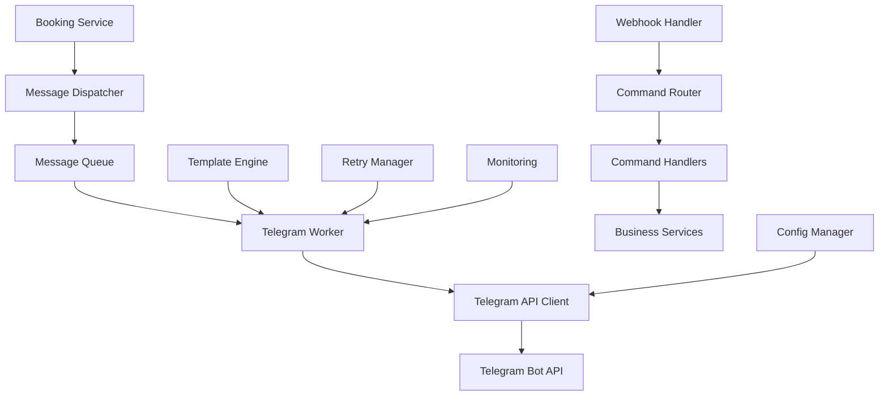
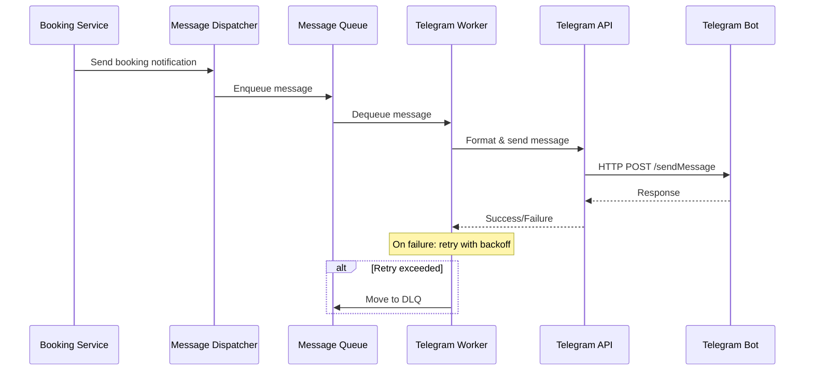

# Telegram Integration Refactor Design

## Overview

This document outlines a comprehensive refactoring of the Telegram integration system for the phStudio photo booking platform. The current implementation suffers from code duplication, inconsistent error handling, poor separation of concerns, and lacks enterprise-grade features such as retry mechanisms, proper observability, and webhook handling.

The refactored system will implement industry best practices including clean architecture, comprehensive error handling, retry mechanisms, proper configuration management, and extensive testing coverage.

## Technology Stack & Dependencies

- **Backend Framework**: FastAPI with async/await patterns
- **HTTP Client**: aiohttp for asynchronous HTTP requests  
- **Message Queue**: Redis for reliable message delivery (new)
- **Monitoring**: Structured logging with correlation IDs
- **Configuration**: Pydantic settings with environment validation
- **Testing**: pytest-asyncio with aioresponses for HTTP mocking
- **Validation**: Pydantic models for all data structures

## Current Issues Analysis

### Code Quality Issues
- **Duplicated Services**: Two separate classes (`TelegramBotService`, `TelegramService`) with overlapping functionality
- **Mixed Responsibilities**: Business logic mixed with infrastructure concerns
- **Inconsistent Error Handling**: Some methods use exceptions, others return boolean
- **No Retry Logic**: Failed messages are lost permanently
- **Hardcoded Values**: Russian text and service names embedded in code
- **Poor Validation**: Repetitive validation logic across multiple files

### Architecture Issues
- **Tight Coupling**: Direct HTTP calls embedded in business logic
- **No Abstraction**: No interface/protocol for message sending
- **Missing Observability**: Limited logging and no metrics
- **No Webhook Processing**: Minimal webhook handling for user interactions
- **Configuration Issues**: Missing validation and defaults

## Architecture

### High-Level Architecture



### Component Definitions

#### 1. Message Dispatcher
**Purpose**: Central message routing and queuing
**Responsibilities**:
- Route messages to appropriate queues
- Handle message priorities
- Provide synchronous API for business services

#### 2. Telegram API Client
**Purpose**: HTTP communication with Telegram Bot API
**Responsibilities**:
- Handle HTTP requests/responses
- Manage rate limiting
- Implement circuit breaker pattern
- Provide connection pooling

#### 3. Message Queue System
**Purpose**: Reliable message delivery
**Responsibilities**:
- Queue messages for async processing
- Handle message persistence
- Support retry mechanisms
- Dead letter queue management

#### 4. Template Engine
**Purpose**: Message formatting and localization
**Responsibilities**:
- Render messages from templates
- Support multiple languages
- Validate template parameters
- Cache compiled templates

#### 5. Webhook Handler
**Purpose**: Process incoming Telegram updates
**Responsibilities**:
- Validate webhook signatures
- Route commands to handlers
- Handle callback queries
- Manage user sessions

### Data Flow Architecture



## Core Components Design

### 1. Unified Telegram Service Interface

```python
from abc import ABC, abstractmethod
from typing import Optional, Dict, Any, List
from enum import Enum
from pydantic import BaseModel
import uuid

class MessagePriority(Enum):
    LOW = "low"
    NORMAL = "normal"
    HIGH = "high"
    CRITICAL = "critical"

class TelegramMessage(BaseModel):
    message_id: str = Field(default_factory=lambda: str(uuid.uuid4()))
    chat_id: str
    text: str
    parse_mode: Optional[str] = "HTML"
    reply_markup: Optional[Dict[str, Any]] = None
    priority: MessagePriority = MessagePriority.NORMAL
    retry_count: int = 0
    max_retries: int = 3
    created_at: datetime = Field(default_factory=datetime.utcnow)
    
class TelegramServiceProtocol(Protocol):
    async def send_message(self, message: TelegramMessage) -> MessageResult
    async def send_message_batch(self, messages: List[TelegramMessage]) -> List[MessageResult]
    async def get_bot_info(self) -> BotInfo
    async def set_webhook(self, url: str, secret_token: str) -> bool
```

### 2. Template Engine with Localization

```python
from jinja2 import Environment, DictLoader
from typing import Dict, Any, Optional
from enum import Enum

class Language(Enum):
    RU = "ru"
    EN = "en"

class TemplateType(Enum):
    BOOKING_NOTIFICATION = "booking_notification"
    BOOKING_CONFIRMATION = "booking_confirmation" 
    BOOKING_CANCELLATION = "booking_cancellation"
    BOOKING_REMINDER = "booking_reminder"

class TelegramTemplateEngine:
    def __init__(self):
        self._templates = {
            "ru": {
                "booking_notification": """
🎨 Новое бронирование

📋 Услуга: {{ service }}
📅 Дата: {{ date }}
🕒 Время: {{ times | join(', ') }}
👤 Клиент: {{ client_name }}
📞 Телефон: {{ client_phone }}
👥 Количество человек: {{ people_count }}
💰 Сумма: {{ total_price }} руб.
""",
                "booking_confirmation": """
✅ Бронирование подтверждено

🆔 ID: {{ booking_id }}
👤 Клиент: {{ client_name }}
📅 Дата: {{ date }}
🕒 Время: {{ time }}

📝 Дополнительная информация:
{{ additional_info }}

"""
            }
        }
        
    def render_template(self, template_type: TemplateType, language: Language, **kwargs) -> str:
        template = self._get_template(template_type, language)
        return template.render(**kwargs)
        
    def _get_template(self, template_type: TemplateType, language: Language):
        env = Environment(loader=DictLoader(self._templates[language.value]))
        return env.get_template(template_type.value)
```

### 3. Configuration Management

```python
from pydantic import BaseSettings, Field, validator
from typing import Optional, List
import os

class TelegramConfig(BaseSettings):
    # Bot Configuration
    bot_token: str = Field(..., env="TELEGRAM_BOT_TOKEN")
    chat_id: str = Field(..., env="TELEGRAM_CHAT_ID")
    webhook_url: Optional[str] = Field(None, env="TELEGRAM_WEBHOOK_URL")
    webhook_secret: Optional[str] = Field(None, env="TELEGRAM_WEBHOOK_SECRET")
    
    # API Configuration
    api_timeout: int = Field(30, env="TELEGRAM_API_TIMEOUT")
    connection_pool_size: int = Field(10, env="TELEGRAM_POOL_SIZE")
    max_retries: int = Field(3, env="TELEGRAM_MAX_RETRIES")
    retry_backoff_factor: float = Field(2.0, env="TELEGRAM_RETRY_BACKOFF")
    
    # Rate Limiting
    rate_limit_requests: int = Field(30, env="TELEGRAM_RATE_LIMIT_REQUESTS")
    rate_limit_window: int = Field(60, env="TELEGRAM_RATE_LIMIT_WINDOW")
    
    # Queue Configuration
    redis_url: str = Field("redis://localhost:6379", env="REDIS_URL")
    queue_name: str = Field("telegram_messages", env="TELEGRAM_QUEUE_NAME")
    dlq_name: str = Field("telegram_dlq", env="TELEGRAM_DLQ_NAME")
    
    @validator('bot_token')
    def validate_bot_token(cls, v):
        if not v or not v.startswith(('bot', '123456789:')):
            raise ValueError('Invalid bot token format')
        return v
        
    @validator('chat_id')
    def validate_chat_id(cls, v):
        if not v or (not v.startswith('-') and not v.isdigit()):
            raise ValueError('Invalid chat ID format')
        return v
```

### 4. Message Queue Implementation

```python
import asyncio
import redis.asyncio as redis
import json
from typing import Optional, List
from datetime import datetime, timedelta

class TelegramMessageQueue:
    def __init__(self, config: TelegramConfig):
        self.config = config
        self.redis_client = None
        
    async def initialize(self):
        self.redis_client = redis.from_url(self.config.redis_url)
        
    async def enqueue_message(self, message: TelegramMessage) -> bool:
        try:
            message_data = message.json()
            await self.redis_client.lpush(self.config.queue_name, message_data)
            return True
        except Exception as e:
            logger.error(f"Failed to enqueue message: {e}")
            return False
            
    async def dequeue_message(self) -> Optional[TelegramMessage]:
        try:
            message_data = await self.redis_client.brpop(self.config.queue_name, timeout=1)
            if message_data:
                return TelegramMessage.parse_raw(message_data[1])
            return None
        except Exception as e:
            logger.error(f"Failed to dequeue message: {e}")
            return None
            
    async def move_to_dlq(self, message: TelegramMessage, error: str):
        dlq_message = {
            "original_message": message.dict(),
            "error": error,
            "failed_at": datetime.utcnow().isoformat(),
            "retry_count": message.retry_count
        }
        await self.redis_client.lpush(self.config.dlq_name, json.dumps(dlq_message))
```

### 5. Webhook Handler with Command Routing

```python
from fastapi import APIRouter, Request, HTTPException, Depends
from typing import Dict, Any, Optional
import hmac
import hashlib

class TelegramWebhookHandler:
    def __init__(self, config: TelegramConfig):
        self.config = config
        self.command_handlers = {}
        
    def register_command(self, command: str, handler: callable):
        self.command_handlers[command] = handler
        
    async def process_update(self, update: Dict[str, Any]) -> Dict[str, str]:
        try:
            if "message" in update:
                await self._handle_message(update["message"])
            elif "callback_query" in update:
                await self._handle_callback_query(update["callback_query"])
            return {"status": "ok"}
        except Exception as e:
            logger.error(f"Error processing update: {e}")
            raise HTTPException(status_code=500, detail="Internal server error")
            
    async def _handle_message(self, message: Dict[str, Any]):
        text = message.get("text", "")
        chat_id = message["chat"]["id"]
        
        if text.startswith("/"):
            command = text.split()[0][1:]  # Remove leading /
            handler = self.command_handlers.get(command)
            if handler:
                await handler(chat_id, message)
            else:
                await self._send_unknown_command_response(chat_id)
                
    async def _handle_callback_query(self, callback_query: Dict[str, Any]):
        data = callback_query.get("data")
        chat_id = callback_query["message"]["chat"]["id"]
        
        if data in ["confirm", "reject"]:
            await self._handle_booking_action(chat_id, data, callback_query)
            
    def verify_webhook_signature(self, payload: bytes, signature: str) -> bool:
        if not self.config.webhook_secret:
            return True  # Skip verification if no secret configured
            
        expected_signature = hmac.new(
            self.config.webhook_secret.encode(),
            payload,
            hashlib.sha256
        ).hexdigest()
        
        return hmac.compare_digest(signature, expected_signature)
```

## API Endpoints Reference

### Webhook Endpoint

```python
@router.post("/webhook")
async def telegram_webhook(
    request: Request,
    webhook_handler: TelegramWebhookHandler = Depends(get_webhook_handler)
):
    """Handle incoming Telegram webhook updates"""
    
    payload = await request.body()
    signature = request.headers.get("X-Telegram-Bot-Api-Secret-Token", "")
    
    if not webhook_handler.verify_webhook_signature(payload, signature):
        raise HTTPException(status_code=403, detail="Invalid signature")
        
    update = await request.json()
    return await webhook_handler.process_update(update)
```

### Management Endpoints

```python
@router.post("/send")
async def send_message(
    message_request: SendMessageRequest,
    telegram_service: TelegramService = Depends(get_telegram_service)
):
    """Send a message via Telegram (admin only)"""
    
    message = TelegramMessage(
        chat_id=message_request.chat_id,
        text=message_request.text,
        parse_mode=message_request.parse_mode
    )
    
    result = await telegram_service.send_message(message)
    return {"success": result.success, "message_id": result.message_id}

@router.get("/status")
async def get_bot_status(
    telegram_service: TelegramService = Depends(get_telegram_service)
):
    """Get bot information and connectivity status"""
    
    try:
        bot_info = await telegram_service.get_bot_info()
        return {
            "status": "connected",
            "bot_info": bot_info.dict(),
            "webhook_configured": bool(telegram_service.config.webhook_url)
        }
    except Exception as e:
        return {
            "status": "error",
            "error": str(e)
        }
```

## Business Logic Services

### Booking Notification Service

```python
class BookingNotificationService:
    def __init__(
        self,
        message_dispatcher: MessageDispatcher,
        template_engine: TelegramTemplateEngine,
        config: TelegramConfig
    ):
        self.message_dispatcher = message_dispatcher
        self.template_engine = template_engine
        self.config = config
        
    async def send_booking_notification(self, booking_data: BookingData) -> bool:
        try:
            # Render message from template
            message_text = self.template_engine.render_template(
                TemplateType.BOOKING_NOTIFICATION,
                Language.RU,
                service=booking_data.service,
                date=booking_data.date.strftime("%d.%m.%Y"),
                times=booking_data.time_slots,
                client_name=booking_data.client_name,
                client_phone=booking_data.client_phone,
                people_count=booking_data.people_count,
                total_price=booking_data.total_price
            )
            
            # Create inline keyboard
            reply_markup = {
                "inline_keyboard": [
                    [
                        {"text": "✅ Подтвердить", "callback_data": f"confirm_{booking_data.id}"},
                        {"text": "❌ Отклонить", "callback_data": f"reject_{booking_data.id}"}
                    ]
                ]
            }
            
            message = TelegramMessage(
                chat_id=self.config.chat_id,
                text=message_text,
                reply_markup=reply_markup,
                priority=MessagePriority.HIGH
            )
            
            return await self.message_dispatcher.dispatch(message)
            
        except Exception as e:
            logger.error(f"Failed to send booking notification: {e}")
            return False
            
    async def send_booking_confirmation(self, booking_id: str, additional_info: Optional[str] = None) -> bool:
        # Similar implementation using confirmation template
        pass
        
    async def send_booking_cancellation(self, booking_id: str, reason: Optional[str] = None) -> bool:
        # Similar implementation using cancellation template
        pass
```

## Error Handling & Resilience

### Retry Strategy

```python
import asyncio
from functools import wraps
from typing import Optional, Type, Tuple

class RetryConfig:
    max_attempts: int = 3
    backoff_factor: float = 2.0
    base_delay: float = 1.0
    max_delay: float = 60.0
    retriable_exceptions: Tuple[Type[Exception], ...] = (
        aiohttp.ClientError,
        asyncio.TimeoutError,
        ConnectionError
    )

async def retry_with_backoff(
    func,
    config: RetryConfig,
    *args,
    **kwargs
) -> Any:
    last_exception = None
    
    for attempt in range(config.max_attempts):
        try:
            return await func(*args, **kwargs)
        except config.retriable_exceptions as e:
            last_exception = e
            if attempt == config.max_attempts - 1:
                break
                
            delay = min(
                config.base_delay * (config.backoff_factor ** attempt),
                config.max_delay
            )
            
            logger.warning(
                f"Attempt {attempt + 1} failed, retrying in {delay}s: {e}"
            )
            await asyncio.sleep(delay)
    
    raise last_exception
```

### Circuit Breaker Pattern

```python
import time
from enum import Enum
from typing import Optional

class CircuitState(Enum):
    CLOSED = "closed"
    OPEN = "open"
    HALF_OPEN = "half_open"

class CircuitBreaker:
    def __init__(
        self,
        failure_threshold: int = 5,
        timeout: float = 60.0,
        expected_exception: Type[Exception] = Exception
    ):
        self.failure_threshold = failure_threshold
        self.timeout = timeout
        self.expected_exception = expected_exception
        
        self.failure_count = 0
        self.last_failure_time: Optional[float] = None
        self.state = CircuitState.CLOSED
        
    async def __aenter__(self):
        await self._check_state()
        return self
        
    async def __aexit__(self, exc_type, exc_val, exc_tb):
        if exc_type and issubclass(exc_type, self.expected_exception):
            await self._record_failure()
        else:
            await self._record_success()
            
    async def _check_state(self):
        if self.state == CircuitState.OPEN:
            if time.time() - self.last_failure_time >= self.timeout:
                self.state = CircuitState.HALF_OPEN
                logger.info("Circuit breaker entering half-open state")
            else:
                raise CircuitBreakerOpenError("Circuit breaker is open")
                
    async def _record_failure(self):
        self.failure_count += 1
        self.last_failure_time = time.time()
        
        if self.failure_count >= self.failure_threshold:
            self.state = CircuitState.OPEN
            logger.warning(f"Circuit breaker opened after {self.failure_count} failures")
            
    async def _record_success(self):
        self.failure_count = 0
        self.state = CircuitState.CLOSED
```

## Testing Strategy

### Unit Testing Framework

```python
import pytest
from unittest.mock import AsyncMock, MagicMock
from aioresponses import aioresponses
import json

class TestTelegramService:
    @pytest.fixture
    def mock_config(self):
        return TelegramConfig(
            bot_token="123456789:test-token",
            chat_id="-123456789",
            api_timeout=30,
            max_retries=3
        )
        
    @pytest.fixture
    def telegram_service(self, mock_config):
        return TelegramService(mock_config)
        
    @pytest.mark.asyncio
    async def test_send_message_success(self, telegram_service):
        message = TelegramMessage(
            chat_id="-123456789",
            text="Test message"
        )
        
        with aioresponses() as m:
            m.post(
                "https://api.telegram.org/bot123456789:test-token/sendMessage",
                payload={"ok": True, "result": {"message_id": 123}}
            )
            
            result = await telegram_service.send_message(message)
            
            assert result.success is True
            assert result.message_id == 123
            
    @pytest.mark.asyncio
    async def test_send_message_with_retry(self, telegram_service):
        message = TelegramMessage(
            chat_id="-123456789",
            text="Test message"
        )
        
        with aioresponses() as m:
            # First call fails
            m.post(
                "https://api.telegram.org/bot123456789:test-token/sendMessage",
                status=500
            )
            # Second call succeeds
            m.post(
                "https://api.telegram.org/bot123456789:test-token/sendMessage",
                payload={"ok": True, "result": {"message_id": 123}}
            )
            
            result = await telegram_service.send_message(message)
            assert result.success is True
```

### Integration Testing

```python
@pytest.mark.integration
class TestTelegramIntegration:
    @pytest.fixture
    async def real_telegram_service(self):
        config = TelegramConfig(
            bot_token=os.getenv("TEST_TELEGRAM_BOT_TOKEN"),
            chat_id=os.getenv("TEST_TELEGRAM_CHAT_ID")
        )
        service = TelegramService(config)
        await service.initialize()
        yield service
        await service.cleanup()
        
    @pytest.mark.asyncio
    async def test_send_real_message(self, real_telegram_service):
        if not os.getenv("TEST_TELEGRAM_BOT_TOKEN"):
            pytest.skip("No test bot token provided")
            
        message = TelegramMessage(
            chat_id=real_telegram_service.config.chat_id,
            text="🧪 Test message from integration test"
        )
        
        result = await real_telegram_service.send_message(message)
        assert result.success is True
        assert result.message_id is not None
```

### Performance Testing

```python
@pytest.mark.performance
class TestTelegramPerformance:
    @pytest.mark.asyncio
    async def test_message_throughput(self, telegram_service):
        """Test sending multiple messages concurrently"""
        messages = [
            TelegramMessage(
                chat_id="-123456789",
                text=f"Test message {i}"
            )
            for i in range(100)
        ]
        
        with aioresponses() as m:
            for _ in range(100):
                m.post(
                    "https://api.telegram.org/bot123456789:test-token/sendMessage",
                    payload={"ok": True, "result": {"message_id": 123}}
                )
                
            start_time = time.time()
            results = await asyncio.gather(*[
                telegram_service.send_message(msg) for msg in messages
            ])
            end_time = time.time()
            
            assert all(result.success for result in results)
            assert end_time - start_time < 10  # Should complete within 10 seconds
```

## Migration Strategy

### Phase 1: Infrastructure Setup
1. **Redis Integration**: Add Redis dependency and configure message queue
2. **New Service Layer**: Implement new TelegramService alongside existing ones
3. **Configuration Updates**: Add new configuration options with backwards compatibility
4. **Template Engine**: Implement template system with current message formats

### Phase 2: Gradual Migration
1. **Booking Notifications**: Migrate booking notification flow to new system
2. **Webhook Handler**: Implement new webhook processing
3. **Error Handling**: Add retry and circuit breaker mechanisms
4. **Testing**: Comprehensive test coverage for new components

### Phase 3: Legacy Cleanup  
1. **Service Consolidation**: Remove old TelegramService and TelegramBotService
2. **Code Cleanup**: Remove duplicate validation and business logic
3. **Documentation**: Update API documentation and deployment guides
4. **Monitoring**: Add metrics and observability

### Migration Checklist
- [ ] Redis server setup and configuration
- [ ] New service implementation with feature parity
- [ ] Comprehensive test suite (unit + integration)
- [ ] Environment configuration updates
- [ ] Webhook endpoint security implementation
- [ ] Performance testing and optimization
- [ ] Production deployment with rollback plan
- [ ] Legacy code removal and cleanup