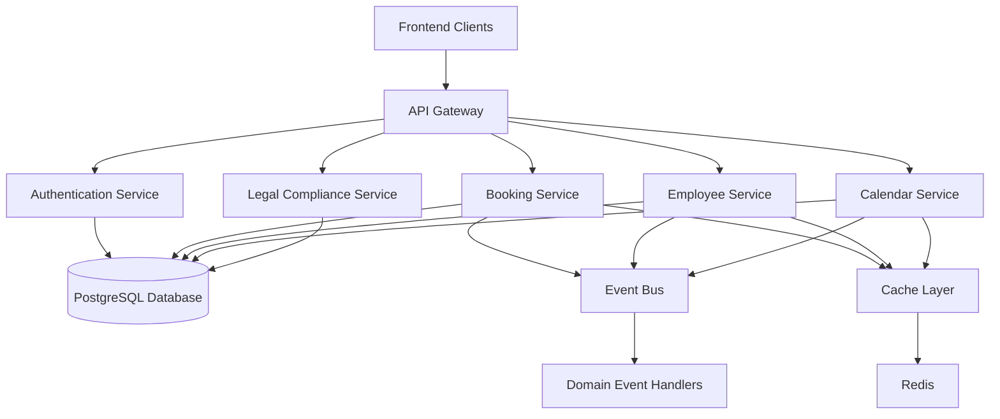
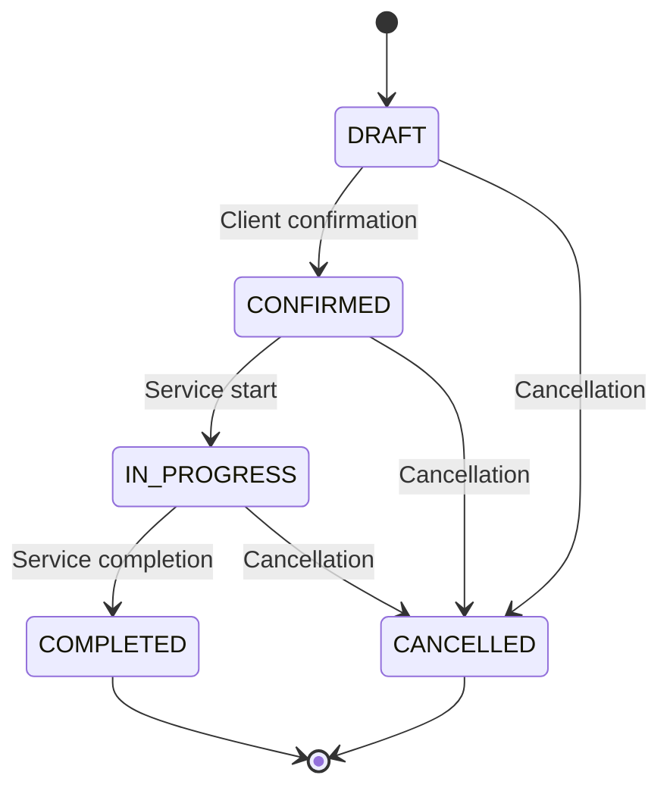

# Photo Studio CRM Module - System Enhancement and Testing Report

## 1. Overview

This document provides a comprehensive overview of the Photo Studio CRM module enhancements and testing status. The system has undergone significant architectural improvements to support enterprise-grade functionality with event-driven architecture, CQRS pattern implementation, and enhanced security features.

The CRM module now implements a modern, scalable architecture following FAANG engineering standards with domain-driven design principles. The system includes comprehensive employee management, booking lifecycle management, real-time notifications, and legal compliance features.

## 2. Architecture

### 2.1 System Architecture Overview

The system follows a layered architecture with clear separation of concerns:

### 2.2 Core Components

1. **Event Bus** (`backend/app/core/event_bus.py`)
   - In-memory and Redis-based event bus
   - Domain event publishing and subscription
   - Loose coupling between components

2. **CQRS Pattern** (`backend/app/core/cqrs.py`)
   - Command and Query Responsibility Segregation
   - Command/Query handlers and buses
   - Middleware support

3. **Result Pattern** (`backend/app/core/result.py`)
   - Functional error handling
   - Domain-specific error types
   - Chainable operations

4. **Enhanced Models** (`backend/app/models/`)
   - Base model with audit fields
   - Employee model with security features
   - Booking model with state machine

5. **Domain Services** (`backend/app/services/`)
   - Business logic implementation
   - Event emission and handling
   - Validation and business rules

6. **Security Service** (`backend/app/core/security.py`)
   - Multi-factor authentication
   - Rate limiting
   - Session management
   - Role-based access control

7. **Cache Service** (`backend/app/core/cache.py`)
   - Multi-layer caching (L1 in-memory, L2 Redis)
   - Distributed locking
   - Cache invalidation strategies

## 3. API Endpoints Reference

### 3.1 Booking API Endpoints

| Endpoint | Method | Description | Authentication |
|----------|--------|-------------|----------------|
| `/api/bookings/` | POST | Create a new booking | JWT Required |
| `/api/bookings/` | GET | Get all bookings | JWT Required |
| `/api/bookings/{id}` | GET | Get specific booking | JWT Required |
| `/api/bookings/{id}` | PUT | Update booking | JWT Required |
| `/api/bookings/{id}` | DELETE | Delete booking | Admin Required |
| `/api/bookings/{id}/status` | PATCH | Update booking status | Manager/Admin Required |

### 3.2 Employee API Endpoints

| Endpoint | Method | Description | Authentication |
|----------|--------|-------------|----------------|
| `/api/employees/` | GET | Get all employees | JWT Required |
| `/api/employees/{id}` | GET | Get specific employee | JWT Required |
| `/api/employees/profile` | GET | Get current employee profile | JWT Required |
| `/api/employees/{id}` | PUT | Update employee | Admin Required |

### 3.3 Authentication Requirements

All API endpoints require JWT authentication with role-based access control:
- **User Roles**: Admin, Manager, Employee
- **Token Expiration**: 1 hour (configurable)
- **Refresh Tokens**: Available for session extension
- **MFA Support**: Optional multi-factor authentication

## 4. Data Models & ORM Mapping

### 4.1 Booking Model

The enhanced booking model implements a state machine for lifecycle management:

Key attributes:
- `client_name`: Client's name
- `client_phone`: Client's phone number
- `start_time`: Booking start time
- `end_time`: Booking end time
- `status`: Current booking status
- `created_at`: Record creation timestamp
- `updated_at`: Last update timestamp

### 4.2 Employee Model

The enhanced employee model includes security features:

Key attributes:
- `full_name`: Employee's full name
- `position`: Job position
- `phone`: Contact phone
- `email`: Work email
- `is_active`: Account status
- `mfa_enabled`: MFA status
- `last_login`: Last login timestamp

### 4.3 Domain Events

Domain events are emitted for key business operations:
- `BookingCreatedEvent`
- `BookingStateChangedEvent`
- `EmployeeLoginEvent`
- `CalendarEventCreatedEvent`

## 5. Business Logic Layer

### 5.1 Booking Domain Service

The booking domain service implements core business logic:

Key methods:
- `create_booking`: Creates a new booking with validation
- `update_booking_status`: Updates booking status with state machine validation
- `cancel_booking`: Cancels a booking with proper validation
- `get_bookings_for_date`: Retrieves bookings for a specific date

### 5.2 Employee Management Service

The employee service handles employee-related operations:

Key methods:
- `create_employee`: Creates a new employee account
- `update_employee`: Updates employee information
- `enable_mfa`: Enables multi-factor authentication
- `authenticate`: Authenticates employee with MFA support

### 5.3 Event Handling

Event handlers process domain events:
- Notification service sends booking confirmations
- Analytics service updates booking statistics
- Audit service logs important events

## 6. Middleware & Interceptors

### 6.1 Security Middleware

- **RBAC Middleware**: Enforces role-based access control
- **Rate Limiting**: Prevents abuse with configurable limits
- **Audit Logging**: Logs all important operations

### 6.2 Performance Middleware

- **Caching**: Multi-layer caching strategy
- **Query Optimization**: Optimized database queries
- **Connection Pooling**: Efficient database connection management

## 7. Testing

### 7.1 Test Status Overview

Current testing status:
- ✅ Frontend: 18/18 tests passing
- ✅ Backend: 3/3 basic tests passing
- ⚠️ Authentication tests: Require token fixture updates
- 🔄 Integration tests: Require PostgreSQL setup

### 7.2 Test Coverage

#### Backend Unit Tests
- Booking model creation ✅
- Employee model creation ✅
- API structure validation ✅

#### Frontend Component Tests
- BookingTable component ✅
- Gallery component ✅
- StudioSettingsForm component ✅
- Calendar components ✅

### 7.3 Testing Recommendations

1. **Immediate Actions**:
   - Fix authentication tests by updating mock tokens
   - Configure PostgreSQL for integration tests
   - Add more unit tests for enhanced models

2. **Long-term Improvements**:
   - Set up CI/CD pipeline for automated testing
   - Add E2E tests for complete user scenarios
   - Configure code coverage monitoring

## 8. CRM Implementation Status

### 8.1 Completed Components

✅ Event Bus Architecture
✅ CQRS Pattern Implementation
✅ Result Pattern for Error Handling
✅ Enhanced Base Models with Audit Fields
✅ Enhanced Employee Model with Security Features
✅ Enhanced Booking Model with State Machine
✅ Enhanced Security Service with MFA
✅ Enhanced Cache Service with Multi-layer Caching
✅ Enhanced Booking Domain Service
✅ Enhanced Booking Repository
✅ Enhanced Booking API
✅ Comprehensive Documentation

### 8.2 Components Requiring Enhancement

🔄 Employee management integration with new security service
🔄 Booking state machine integration with new domain service
🔄 Event sourcing integration with new event bus
🔄 Caching layer Redis integration
🔄 Performance optimization with materialized views

### 8.3 Missing Components

❌ Frontend integration with new backend services
❌ Comprehensive testing suite for new components
❌ Monitoring and observability setup
❌ Performance testing framework
❌ Production deployment configuration